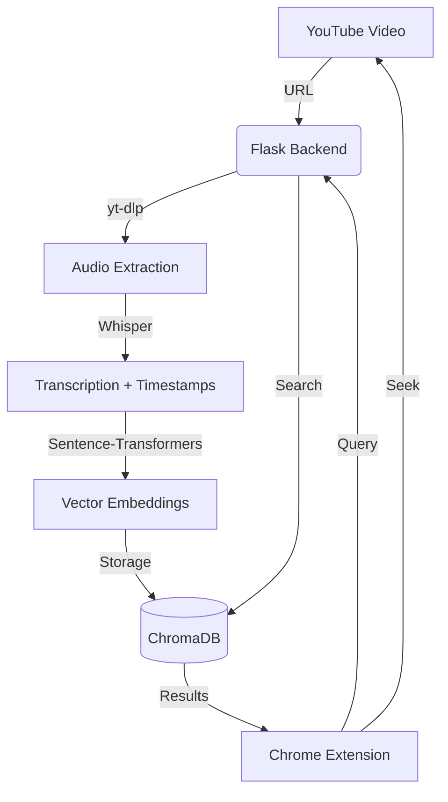

# 🔍 YouTube Semantic Search

> Search inside any YouTube video by concept, not just keywords. Jump to the exact moment a topic is discussed.


---

## 📺 Overview

YouTube Semantic Search is a browser-integrated tool that allows users to perform "concept-based" searches within a video's transcript. Unlike standard keyword search (Ctrl+F), this tool uses advanced NLP to understand the meaning of your query and find relevant moments even if the exact words weren't spoken.

### Key Features
- **Semantic Retrieval**: Search for concepts (e.g., searching "explaining neural networks" will find "weight updates" and "backpropagation").
- **Direct Navigation**: Click search results to instantly jump the YouTube player to that timestamp.
- **GPU Accelerated**: Optimized for NVIDIA GPUs using CUDA for lightning-fast transcription and embedding generation.
- **Isolated Sidebar**: A sleek, non-intrusive UI injected directly into the YouTube interface.

---

## 🏗️ Architecture



---

## 🛠️ Tech Stack

### Backend
- **Framework**: Flask (Python)
- **Transcription**: OpenAI Whisper (Speech-to-Text)
- **Vector Engine**: ChromaDB (High-performance vector store)
- **Embeddings**: Sentence-Transformers (`all-MiniLM-L6-v2`)
- **Reranker**: Cross-Encoders for high-precision retrieval
- **Containerization**: Docker + Docker Compose

### Chrome Extension
- **API**: Manifest V3
- **Logic**: Vanilla JavaScript
- **UI**: Standardized Neo-Brutalist Sidebar
- **Communication**: PostMessage API for Parent-Iframe bridge

---

## 🚀 Getting Started

### 1. Prerequisites
- [Docker Desktop](https://www.docker.com/products/docker-desktop/) installed.
- (Optional but Recommended) NVIDIA GPU with [NVIDIA Container Toolkit](https://docs.nvidia.com/datacenter/cloud-native/container-toolkit/latest/install-guide.html) installed for hardware acceleration.

### 2. Backend Setup
Clone the repository and spin up the containerized backend:

```bash
cd backend
docker-compose up --build
```
*The first run will download ~4GB of CUDA libraries and pre-trained models. This is a one-time setup.*

### 3. Extension Setup
1. Open Chrome and navigate to `chrome://extensions/`.
2. Enable **Developer mode** (top right).
3. Click **Load unpacked**.
4. Select the `chrome-extension` folder from this repository.

---

## 📖 Usage
1. Open any YouTube video.
2. Click the **Red Magnifying Glass** toggle on the right side of the screen to open the sidebar.
3. Click **"Ingest Video"** to process the audio (Progress is tracked in real-time).
4. Once ingested, type your query in the search bar.
5. Click on a result card to jump to that timestamp in the video.

---

## ⚙️ Configuration
The backend is configured via environment variables in `docker-compose.yml`:
- `PYTHONUNBUFFERED`: Ensures logs appear instantly.
- `SENTENCE_TRANSFORMERS_HOME`: Persists model weights.
- `WHISPER_CACHE`: Persists transcription models.

---

## 🤝 Contributing
Contributions are welcome! Please open an issue or submit a pull request for any improvements or bug fixes.

## 📄 License
This project is licensed under the MIT License.
